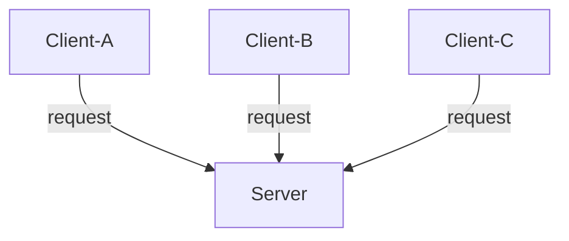
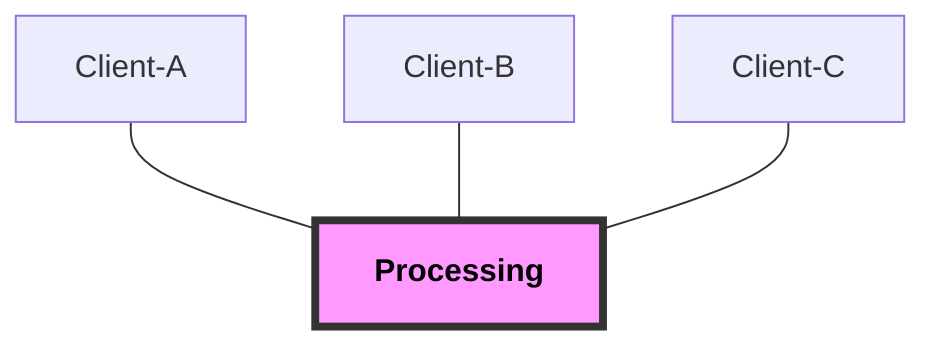
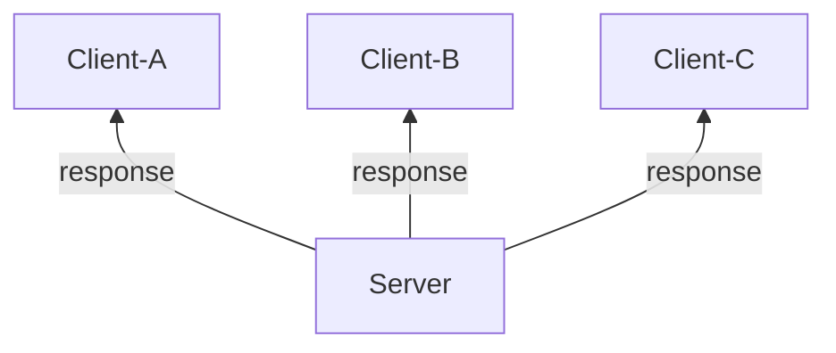

# 1. 서버의 기본

## 1.1. 서버를 이해하는 것은 시스템을 이해하는 것

> 시스템(서비스)을 위해서는 서버가 있어야 한다.
> 

- 서버는 시스템에서 중심적 역할을 수행
- 애플리케이션을 동작시키는 주역할

## 1.2. 서버는 시스템의 사령탑

> 서버는 적절한 지시를 내리는 존재이다.
> 

- 서버의 이용 형태 3가지
    1. 클라이언트의 요청에 대응하여 처리하는 형태
    2. 서버에서 능동적으로 처리하는 형태
    3. 높은 성능을 활용하는 형태
    

## 1.3. 클라이언트의 요청에 대응하여 처리하는 형태

> Client-Server(Request-Response) 구조의 기본 형태이다.
> 

### 특징

- Server 한 대, Client 여러 대
- Client 는 Server 에 수시로 Request

## 1.4. 서버가 능동적으로 처리하는 형태

> Client 의 request 가 없어도, Server 에서 처리를 시작한다.
> 

### 특징

- Server 한 대, Client 여러 대
- Server 에서 처리 시점을 정해 실행

scheduler 생각하기

## 1.5. 높은 성능을 활용하는 형태

> 성능이 높은 Server 를 이용한다.
> 

- [x]  Client 에서 start?
- [x]  Server 에서 start?

관점이 다름

- [x]  Server 의 성능이 어떤지?

### 특징

- 구조의 다양성
    1. Server 한 대, Client 여러 대
        - service
    2. Server 단독
        - process
        

### example

- AI Server
- Big data Server

## 1.6. 서버에 접속하는 기기

> Client 가 될 수 있는 종류는 다양하다.
> 

- 대표적인 경우: 컴퓨터, 노트북, 태블릿, 휴대폰
- IoT 관점으로 추가되는 경우: IoT 기기(카메라, 마이크), 드론, 로봇

## 1.7. 순발력인가 지구력인가

> 일반적으로 시스템의 목적은 입출력과 분석으로 구분할 수 있다.
> 

입출력이 중요한 시스템 -> 순발력이 필요 (빠른 응답)
분석이 중요한 시스템 -> 지구력이 필요 (긴 시간동안 처리 가능)

## 1.8. 시스템 모델화 및 구성

> 시스템에 대한 모델화 작업을 하면 서버에 대한 요구를 명확히 할 수 있게 된다.
> 
- 모델화 작업할 때 고려해야 할 사항
    - HW 관점
    - SW 관점
    - 접속 기기

## 1.9. 기본적인 시스템 구성

> 기본적인 시스템을 구성할 때 고려해야 할 요소들을 정리한다.
> 
- Client 여러 대, Server 한 대
- 무선 LAN 증가로 유선 LAN 을 사용할 때보다 좌석 자유도가 높아짐
- 서버는 사령탑
