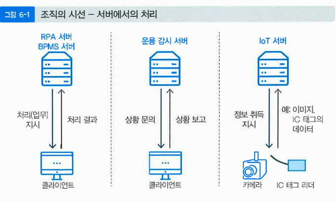

# 서버로부터의 처리와 고성능 처리

발표자: 이호영
챕터: 6

# 서버의 처리

서버가 클라이언트나 하위의 컴퓨터 및 디바이스에게 명령이나 지시를 하여 관리

## 시스템 운용 감시

- 시스템이 정상으로 동작하는지 감시하는 일
- 운용 감시는 전용 서버에서 실시

### 목표

시스템이나 서버를 안정적으로 가동

### 역할

- 리소스 검사: cpu, 메모리 사용률과 네트워크 트래픽 감시
- 헬스 체크: 서버와 네트워크 기기가 동작하는지 확인

## IOT

다양한 디바이스에서 올라오는 데이터를 서버가 모아 저장, 분석, 판단 등을 함

### 데이터 수집의 두 가지 형태

1. 디바이스가 획득 혹은 보유한 데이터를 디바이스 주도로 서버에 보낸다(클라이언트에서 자율적으로 보냄, 클라이언트-서버)-자율적으로 촬영하여 영상을 전송
2. 상위 장치의 명령으로 데이터를 서버에 보낸다(서버가 주도, 능동적인 기능)-서버에서 명령을 발행할 때 촬영을 시작해서 영상을 얻는 방식

## RPA

- Robotic Process Automation
- 업무를 자동화하는 도구
- 사람이 할 조작을 자동으로 처리
- 조작을 통합해서 관리하기도 함

### 구성

1. 조작을 자동으로 하는 로봇 파일
2. 실행 환경
3. 개발 환경
4. 로봇 파일 관리 

- 각 데스크탑에서 로봇 파일과 실행 환경을 가져와 실행

## BPMS

- **정의:** Business Process Management System의 약어로, 업무 프로세스를 분석하고 개선하는 단계를 반복하며 업무 개선을 지원하는 시스템
- **주요 특징:**
    1. **프로세스와 데이터 플로우 변경의 용이성:**
        - 템플릿을 삭제하거나 이동하여 업무 프로세스와 데이터 플로우 변경 가능
    2. **자율적인 분석에 의한 솔루션 제공:**
        - 각 프로세스의 처리량, 시간 등을 기록해 분석 결과를 제공
            
            
            
- **BPMS 서버의 역할:**
    - 업무 관리자의 지시에 따라 업무의 사령탑 역할을 수행

### **BPMS가 주목받는 이유**

- 기업에서 업무 자동화와 무인화의 필요성이 증가하면서 주목받고 있음
- **RPA와의 연계성:**
    - 사람이 하는 업무 외에도 RPA와 같은 로봇 또는 관리 소프트웨어 포함
- **용도 확장성:**
    - 업무 뿐 아니라 등록 관리 등 다양한 제품으로 확장 가능

# AI와 서버의 관계

### AI 시스템에 대한 두 가지 접근

### **1. 클라우드로 제공되는 AI 시스템 활용**

- **내용:**
    - IT 벤더나 클라우드 사업자가 제공하는 AI 시스템을 사용하여 로직 정의 및 데이터 계산 처리
    - 주요 장점: 클라우드의 편리성과 최신 환경 제공

### **2. 직접 AI 서버를 설치**

- **내용:**
    - Python, C++ 등 프로그래밍 언어와 TensorFlow 등의 AI 개발 도구를 활용하여 독자적으로 AI 시스템 구축
    - 주요 특징: 외부 의존도를 낮추고 맞춤형 처리 가능

**1번 방식:** 간단히 시작하거나 클라우드 기반 서비스를 선호하는 경우

**2번 방식:** 데이터 보안이 중요하거나 맞춤형 고성능 시스템이 필요한 경우

### **직접 AI 서버 설치를 선호하는 이유**

1. **데이터 보안과 독립성 확보:**
    - 데이터를 외부로 내보내지 않고 자체적으로 처리하려는 의도
2. **현실적 요구사항:**
    - 대규모 데이터 처리와 높은 성능의 서버 필요:
        - 방대한 학습 데이터와 복잡한 작업 수행 가능
        - 기존 PC보다 높은 견고성과 성능 제공

# 빅데이터와 서버의 관계

### **1. 빅데이터의 특징**

- **변화와 진화:**
    - SNS, 온라인 쇼핑 등의 발전으로 인해 데이터 양과 종류가 빠르게 증가
    - 기존 DBMS 기반의 구조화된 데이터 외에 **비구조화 데이터**(예: 텍스트 데이터) 분석도 필요
- **분석의 복잡성:**
    - 비구조화 데이터는 구조화 데이터보다 분석이 더 어려움

### **빅데이터 처리의 필요성**

- 데이터 양이 방대해 사람이 Excel 등으로 분석하는 것은 불가능
- 데이터의 양과 복잡성 때문에 전용 서버가 필요
- **병렬 처리**와 **빠른 처리 속도**가 요구됨

### 하둡

- **정의:**
    - 대량의 데이터를 고속으로 처리하기 위한 오픈소스 미들웨어
    - 구조화 데이터뿐 아니라 비구조화 데이터도 효율적으로 처리 가능
- **특징:**
    - PC 서버로 구현 가능하며, 서버를 대량으로 연결해 방대한 데이터를 분산 처리
    - 데이터 센터 등에서 서버를 집중적으로 관리하며 대규모 데이터를 처리

### **2. 하둡(Hadoop)의 원리**

- **작업 방식:**
    - 데이터를 작게 나누어 병렬 처리
- **장점:**
    - 병렬 처리로 인해 데이터 처리 속도가 빠름
    - 비구조화 데이터 검색 및 대규모 데이터 분석에 강점

